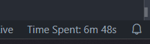

# How Long Am I Coding For?

This VSCode extension tracks and displays the total amount of time you have spent coding in VSCode. The time is shown in the status bar and is persisted across sessions.



## Usage

Once installed, the extension will automatically start tracking your time in the background when you open VSCode. The total time spent will be displayed in the status bar at the bottom-right of the window.

You can see the total time in the format:

```
Time Spent: 5m 30s
```

The time is saved between sessions, so when you reopen VSCode, the time continues from where it left off.

## Commands

This extension does not require any manual commands to be run. The time tracking starts automatically upon activation and stops when you close VSCode.

## Development

To develop or contribute to this extension, follow these steps:

1. Clone the repository.
2. Install dependencies:

    ```bash
    npm install
    ```

3. Compile and package the extension:

    ```bash
    npm run package
    ```

4. Open the project in VSCode and press `F5` to start debugging the extension.

## License

This project is licensed under the MIT License - see the [LICENSE](LICENSE) file for details.
